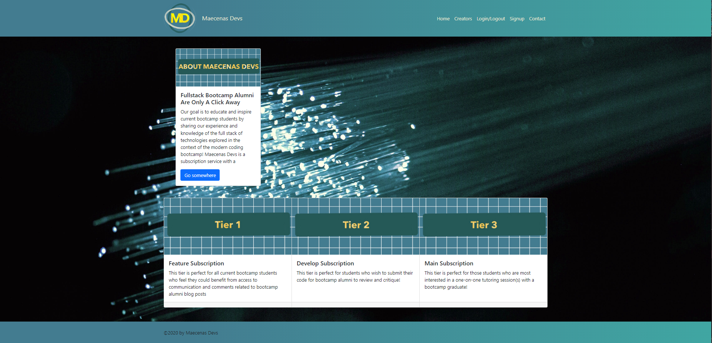

# MaecenasDevs
***
#### Created by Maecenas Devs
## Description 

MaecenasDevs is an online platform where alumni of bootcamp programs who are now industry professionals, can provide mentorship to aspiring developers. Creators (alumni developers) can offer up to three tiers of services. Users (apiring developers) can choose to subscribe to Creators depending on the Creator's stack speciality. 

## Table of Contents 
* [Website](#Website)
* [Installation](#Installation)
* [Usage](#Usage)
* [Test](#Test)
* [Contributors](#contributors)
* [Technology](#technology)
* [License](license)
* [Questions](#Questions)

***

## Website
Here is a link to the live website:
[MaecenasDevs](https://gentle-citadel-11319.herokuapp.com/)

## Usage
This project can be used to create...

## Contributors
[Jonathan Kim](https://github.com/JonathanKim424)
[Andrew Kim](https://github.com/andrewyk99)
[Jake Lauterstein](https://github.com/jakelauterstein)
[Kavya Mantena](https://github.com/KavyaMantena)
[Victoria Rice](https://github.com/vtori37)

## Technology
* HTML5
* CSS 
* JS
* React
* Bootstrap
* Apollo Server
* GraphQL

### Questions
If you have any questions or concerns regarding this project, feel free to create an issue. 
